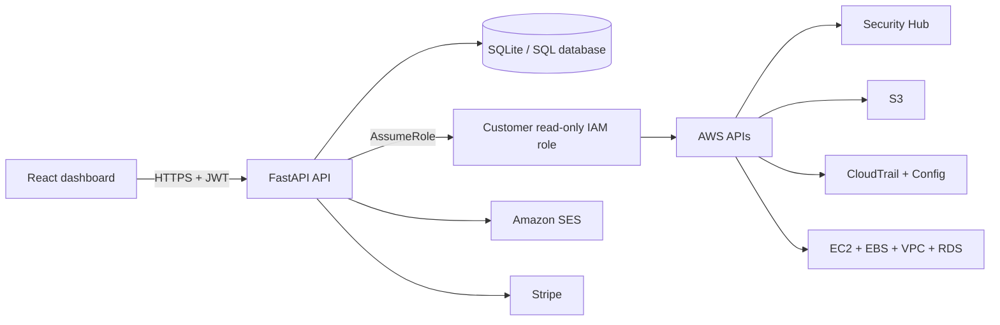

# CloudAuditPro

CloudAuditPro is an AWS security posture and compliance intelligence platform. It connects to customer AWS accounts through a read-only IAM role, evaluates security controls, inventories exposed resources, and presents actionable findings in a React dashboard.

> CloudAuditPro supports compliance readiness and continuous monitoring. It does not provide certification, legal advice, or an audit opinion.

## Features

- Read-only, cross-account AWS access with AWS STS
- Security Hub finding summaries
- Security checks for S3, CloudTrail, AWS Config, EBS, and IAM
- EC2, VPC, RDS, and security group inventory
- Attack-surface visibility
- Control mapping for CIS AWS Foundations, PCI DSS, and SOC 2
- Multi-account management
- JWT-based user authentication and password reset
- HTML email reports through Amazon SES
- Stripe checkout integration

## Architecture



| Layer | Technology |
| --- | --- |
| Frontend | React 19, Vite, Tailwind CSS |
| API | Python, FastAPI, Uvicorn |
| Persistence | SQLAlchemy; SQLite by default |
| AWS integration | Boto3, STS, Security Hub, S3, EC2, RDS, Config, CloudTrail, IAM, SES |
| Authentication | JWT and bcrypt |
| Billing | Stripe |

## Repository layout

```text
CloudAuditPro/
├── backend/
│   ├── app/                  # FastAPI application, AWS checks, and data models
│   ├── migrations/           # SQL migrations
│   ├── requirements.txt
│   └── zappa_settings.json
├── frontend/
│   ├── src/                  # React application
│   └── package.json
├── infra/
│   └── iam/                  # Customer-account IAM templates and policies
├── extra_documentation/      # Architecture and onboarding references
├── run.sh                    # Local frontend/backend launcher
└── LICENSE
```

## Local development

### Prerequisites

- Python 3.10 or newer
- Node.js 20.19+ or 22.12+
- npm
- AWS credentials for an identity allowed to call `sts:AssumeRole` if you want to run live scans

### 1. Clone and install

```bash
git clone <repository-url>
cd CloudAuditPro

python3 -m venv backend/venv
source backend/venv/bin/activate
python -m pip install -r backend/requirements.txt

cd frontend
npm install
cd ..
```

### 2. Configure the backend

Create `backend/.env`:

```dotenv
APP_ENV=dev
JWT_SECRET=replace-with-a-long-random-value
DATABASE_URL=sqlite:///./cloudauditpro.db

AWS_DEFAULT_REGION=us-east-1
EXTERNAL_ID=cloudauditpro

FRONTEND_ORIGIN=http://localhost:5173
APP_URL=http://localhost:5173
WEBSITE_URL=http://localhost:5173

# Optional: email reports and password resets
SES_FROM_ADDRESS=
TEST_REPORT_RECIPIENT=

# Optional: billing
STRIPE_SECRET_KEY=
STRIPE_PRICE_ID=
CHECKOUT_SUCCESS_URL=http://localhost:5173/success
CHECKOUT_CANCEL_URL=http://localhost:5173/

# Optional: hosted CloudFormation onboarding template
CFN_TEMPLATE_BUCKET=
CFN_TEMPLATE_KEY=cloudauditpro-read-role.yaml
CFN_TEMPLATE_REGION=us-east-1
CFN_TEMPLATE_EXPIRES=900
```

Do not commit `.env` files or production credentials. `JWT_SECRET` must be replaced in every non-local environment.

### 3. Configure the frontend

Create `frontend/.env.local`:

```dotenv
VITE_API_BASE=http://127.0.0.1:8000
VITE_API_BASE_URL=http://127.0.0.1:8000
VITE_APP_VERSION=v0.1.0
VITE_CF_TEMPLATE_URL=
```

Both API variables are currently required: the main API client reads `VITE_API_BASE`, while authentication and password-reset screens read `VITE_API_BASE_URL`.

### 4. Start the application

```bash
chmod +x run.sh
./run.sh
```

Or run each service separately:

```bash
# Terminal 1
cd backend
source venv/bin/activate
python -m uvicorn app.main:app --reload

# Terminal 2
cd frontend
npm run dev
```

Open:

- Dashboard: [http://localhost:5173](http://localhost:5173)
- API health check: [http://127.0.0.1:8000](http://127.0.0.1:8000)
- Interactive API docs: [http://127.0.0.1:8000/docs](http://127.0.0.1:8000/docs)

The local SQLite database is created automatically in `backend/cloudauditpro.db`.

## Production deployment

| Environment | Database |
| --- | --- |
| Development | SQLite |
| Production | Amazon RDS for PostgreSQL |

Set `DATABASE_URL` to the appropriate database connection string for each environment. SQLite is used by default for local development; production deployments should use an Amazon RDS PostgreSQL instance.

## AWS account onboarding

CloudAuditPro scans customer accounts by assuming a customer-controlled read-only IAM role. A starter CloudFormation template is available at [`infra/iam/cloudauditpro_role.yml`](infra/iam/cloudauditpro_role.yml).

1. Deploy the template in the AWS account to scan.
2. Supply the AWS account ID where CloudAuditPro runs.
3. Keep the template's external ID aligned with the backend `EXTERNAL_ID`.
4. Confirm that the CloudAuditPro runtime identity can call `sts:AssumeRole`.
5. Add the account ID, role name, and region in the dashboard.
6. Run the connection check before starting a scan.

The default role name is `CloudAuditProReadRole`. Review and tailor the included permissions before production use; required permissions depend on the checks you enable.

## API overview

Most scan and account endpoints require an `Authorization: Bearer <token>` header.

| Area | Representative endpoints |
| --- | --- |
| Authentication | `/auth/register`, `/auth/login`, `/auth/me` |
| AWS accounts | `/aws-accounts/`, `/aws/connections` |
| Scanning | `/scan`, `/aws/connection-check` |
| Security checks | `/aws/s3-summary`, `/checks/cloudtrail`, `/checks/config`, `/checks/iam-password-policy`, `/checks/ebs-encryption` |
| Inventory | `/inventory/ec2`, `/inventory/vpc`, `/inventory/rds`, `/inventory/sg`, `/inventory/attack-surface` |
| Compliance | `/compliance/summary` |
| Reporting | `/report/email` |

Use the generated OpenAPI documentation at `/docs` for current request and response schemas.

## Quality checks

```bash
cd frontend
npm run lint
npm run build
```

The repository does not currently include an automated backend test suite.

## Security model

- Customer AWS access uses temporary STS credentials.
- Customer access keys are not stored by the application.
- The onboarding role is intended to be read-only and customer-controlled.
- API scan routes are protected with JWT authentication.
- Cross-origin access is limited to configured frontend origins.

Please report suspected vulnerabilities privately to [sasewani@gmail.com](mailto:sasewani@gmail.com). Do not open a public issue containing sensitive details.

## Compliance disclaimer

CloudAuditPro performs automated technical assessments using the AWS configuration data available to it. Results may be incomplete or require human interpretation. CloudAuditPro does not guarantee compliance and does not replace a qualified assessor, formal audit, certification, or legal advice.

## License

CloudAuditPro™ is proprietary software owned by 9o5 Enterprises, LLC. It is not open source. Unauthorized copying, modification, distribution, sublicensing, or use is prohibited. See [`LICENSE`](LICENSE).

## Contact

Questions, access requests, and partnership inquiries: [sasewani@gmail.com](mailto:sasewani@gmail.com)

© 2026 9o5 Enterprises, LLC. All rights reserved.
